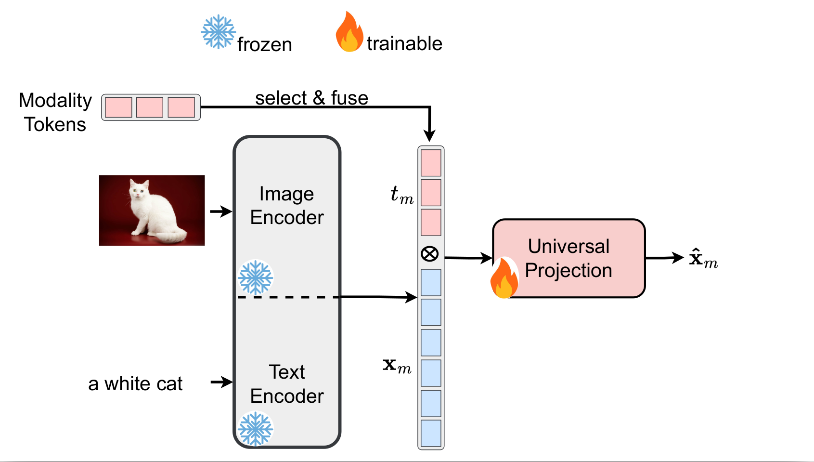
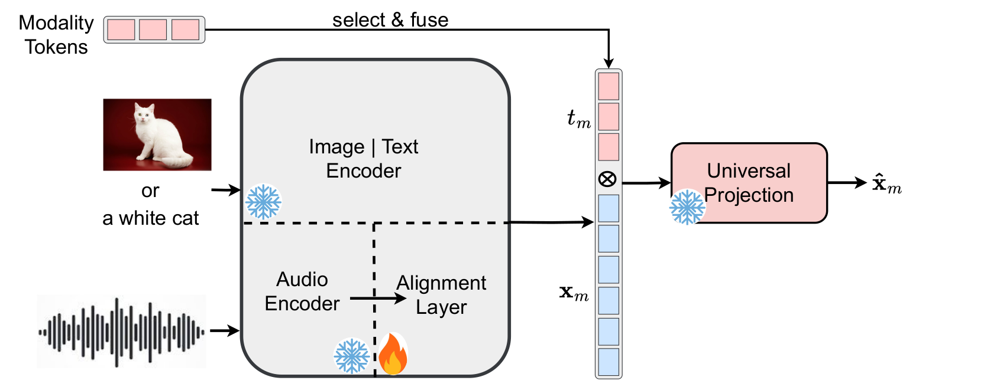
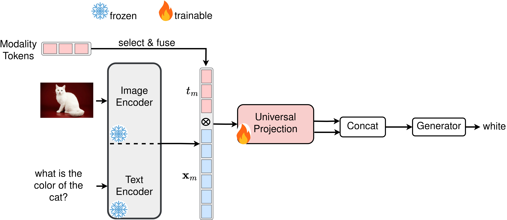

# OneEncoder: A LightWeight Framework For Cross-Modal Representation Learning

## Abstract
Cross-modal alignment learning combines information from text, images, audio, and video to create unified models for tasks like visual question answering and audiovisual analysis. Current methods rely on large, modality-specific encoders trained on vast aligned datasets, which is costly, difficult, and time-consuming. To address this, we propose OneEncoder, a lightweight framework that progressively aligns four modalities. Initially aligning image and text, OneEncoder then integrates other modalities without retraining the entire system. Efficient and cost-effective, it performs well on small paired datasets, surpassing methods dependent on large datasets and specialized encoders.


## Repository Organization

This repository contains two main applications:

- Contrastive Learning for Modality Alignment
- Visual Question Answering (VQA) Task

## Contrastive Learning for Modality Alignment

We use a progressive approach to align multiple modalities:

- **Step 1**: Train only the Universal Projection module (UP) to align image and text.
- **Step 2**: Freeze the pretrained UP and train an Alignment Layer (AL) to progressively align audio and video with the already aligned image and text.

<center><b>Step 1: Train only the UP to align image and text modalities</b></center><br>



<center><b>Step 2: Freeze the UP and train only the Alignment Layer to integrate new modalities (e.g., audio, video)</b></center><br>




## Visual Question Answering (VQA) Task

For the VQA task, we apply our method on the DAQUAR dataset using various combinations of feature extractors:

- ALBERT + BeiT
- ALBERT + DeiT
- ALBERT + ViT
- BERT + BeiT
- BERT + DeiT
- BERT + ViT
- RoBERTa + BeiT
- RoBERTa + DeiT
- RoBERTa + ViT

<center><b>OneEncoder on VQA:</b> The image encoder can be replaced by BeiT, DeiT, or ViT, while the text encoder can be swapped with ALBERT, BERT, or RoBERTa.</center><br>




## Installation
### Requirements
* Linux, CUDA >= 12.1
* Python >= 3.9

    We recommend you to use Anaconda to create a conda environment:

    ```bash
    conda create -n OneEncoder python=3.9 pip
    ```

    Then, activate the environment:
    ```bash
    conda activate OneEncoder
    ```

* Pytorch >= 2.1.1

    For example, if your CUDA version is 12.1, you could install pytorch and torchvision as following:
    ```bash
    conda install pytorch=2.1.1 torchvision=0.16.1 cudatoolkit=12.1 -c pytorch
    ```
* Other requirements
    ```bash
    pip install -r requirements
    ```
## Datasets

All datasets are located in the `datasets` directory.

### Contrastive Learning for Modality Alignment

To train the Universal Projection (UP) module using the contrastive learning method, the following datasets are utilized:

- [COCO Captions](https://www.kaggle.com/datasets/nikhil7280/coco-image-caption)
- [Flickr30k](https://www.kaggle.com/datasets/hsankesara/flickr-image-dataset)
- [TextCaps](https://huggingface.co/datasets/lmms-lab/TextCaps)

### Audio Modality Integration

To integrate the audio modality, the following dataset is used:

- [ibriSpeech Speech Recognition Alignment (SRA)](https://huggingface.co/datasets/nguyenvulebinh/asr-alignment)

### Video Modality Integration

To integrate the video modality, the following dataset is used:

- [Microsoft Research Video to Text (MSR-VTT)](https://huggingface.co/datasets/AlexZigma/msr-vtt)

### X-ray Image Modality Integration

To integrate the X-ray image modality, the following dataset is used:

- [ROCO Dataset](https://www.kaggle.com/datasets/virajbagal/roco-dataset)

### Visual Question Answering (VQA) Task

For the VQA task, the following dataset is used:

- [DAQUAR](https://www.kaggle.com/datasets/tezansahu/processed-daquar-dataset)


# Demo

We suggest creating notebooks demo in the directory demo, utilizing pre-trained weights stored in the weights directory, where the addition operation is employed.
