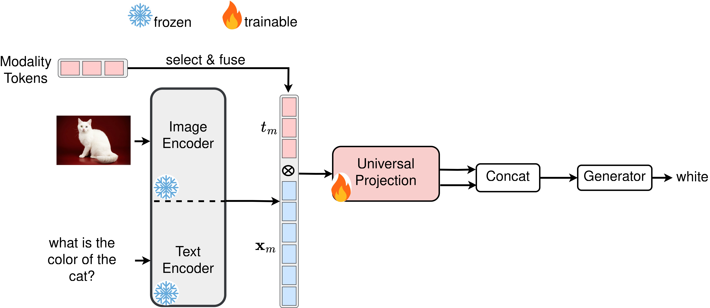

# OneEncoder: A LightWeight Framework For Cross-Modal Representation Learning

## Abstract
Cross-modal alignment learning combines information from text, images, audio, and video to create unified models for tasks like visual question answering and audiovisual analysis. Current methods rely on large, modality-specific encoders trained on vast aligned datasets, which is costly, difficult, and time-consuming. To address this, we propose OneEncoder, a lightweight framework that progressively aligns four modalities. Initially aligning image and text, OneEncoder then integrates other modalities without retraining the entire system. Efficient and cost-effective, it performs well on small paired datasets, surpassing methods dependent on large datasets and specialized encoders.

## Visual Question Answering (VQA) Task

For the VQA task, we apply our method on the DAQUAR dataset using various combinations of feature extractors:

- DistilBERT + BeiT
- DistilBERT + DeiT
- DistilBERT + ViT
- BERT + BeiT
- BERT + DeiT
- BERT + ViT
- RoBERTa + BeiT
- RoBERTa + DeiT
- RoBERTa + ViT

<center><b>OneEncoder on VQA:</b> The image encoder can be replaced by BeiT, DeiT, or ViT, while the text encoder can be swapped with DistilBERT, BERT, or RoBERTa.</center><br>




## Installation
### Requirements
* Linux, CUDA >= 12.1
* Python >= 3.9

    We recommend you to use Anaconda to create a conda environment:

    ```bash
    conda create -n OneEncoder python=3.9 pip
    ```

    Then, activate the environment:
    ```bash
    conda activate OneEncoder
    ```

* Pytorch >= 2.1.1

    For example, if your CUDA version is 12.1, you could install pytorch and torchvision as following:
    ```bash
    conda install pytorch=2.1.1 torchvision=0.16.1 cudatoolkit=12.1 -c pytorch
    ```
* Other requirements
    ```bash
    pip install -r requirements
    ```
## Datasets

All datasets are located in the `datasets` directory.

### Visual Question Answering (VQA) Task

For the VQA task, the following dataset is used:

- [DAQUAR](https://www.kaggle.com/datasets/tezansahu/processed-daquar-dataset)


# Training and Validation

To train using for example bert and beit:

```bash
cd "bert and beit"
python3 bert_beit.py
```


# Demo

<center><b>Querying Results</b></center><br>


